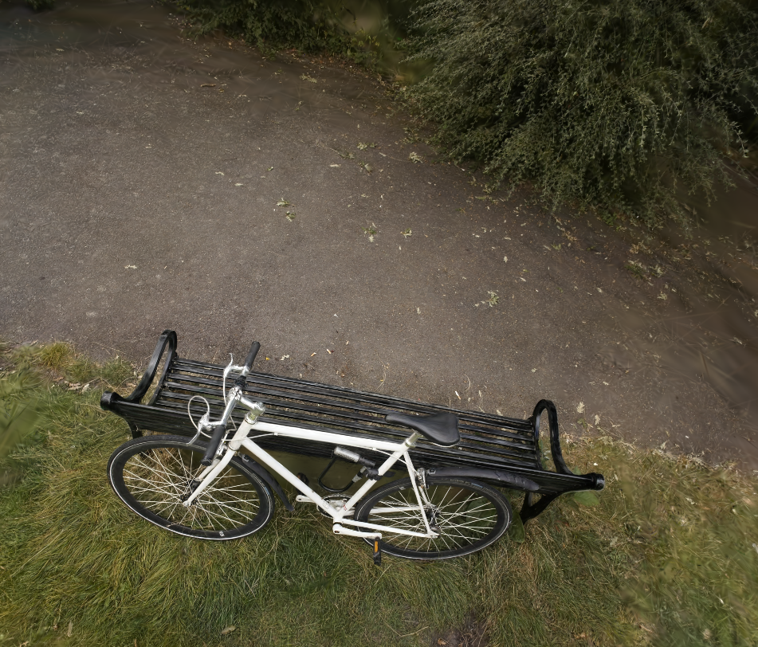
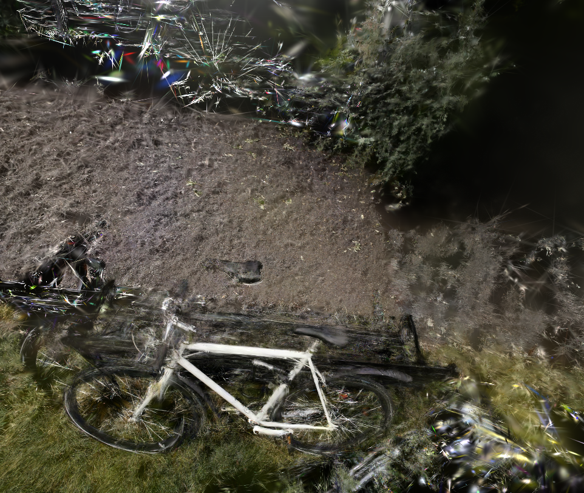

# 3D Gaussian Splatting Inference on Colab

This repository contains experiments and results for **3D Gaussian Splatting (3D-GS)**, including training under dense and sparse settings, along with visual comparisons and rendered outputs.

---

##  Repository Contents

* **3d_gs.ipynb**
  Notebook for training and rendering scenes using **3D Gaussian Splatting**.
  Includes experiments on both full-image datasets and sparse-view settings.
  Useful as a baseline with evaluation metrics.

* **comparison_test_video.mp4**
  A comparison video demonstrating two training setups:

  * **Left:** Model trained on 169 images and tested on 25 images
  * **Right:** Model trained on 7 evenly spaced images and tested on 25 images

* **point_cloud-image.png**
  Rendered image generated from output point clouds using Supersplat.

* **point_cloud_sparse-image.png**
  Rendered image from sparse-view training using Supersplat.

---

##  Rendered Outputs

---

##  Comparison Video

 Download and view:
[comparison_test_video.mp4](comparison_test_video.mp4)

---

##  Key Highlights

* Implementation of **3D Gaussian Splatting**
* Comparison between **dense vs sparse training**
* Visualization using **Supersplat**
* Includes baseline experiments with evaluation metrics

---

##  Notes

* All files are kept in the root directory for simplicity.
* GitHub does not autoplay videos, so download to view the comparison.

---

##  Acknowledgment

This work is part of experimentation and learning in modern **neural rendering techniques**.

